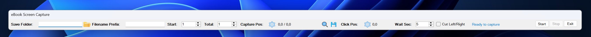

# eBook Screen Capture

A lightweight Windows Forms utility designed to automatically capture a specified region of the screen (e.g., an e-book reader) and simulate "next page" mouse clicks, saving each page as a numbered PNG image.

> [!IMPORTANT]
> **Personal Use Only:** This tool is intended for personal archiving and study purposes only. Do not use this utility to duplicate, distribute, or infringe upon copyrighted, licensed, or protected publications.

## Key Features

- **Automated Capturing**: Grabs a user-defined rectangular screen region.
- **Auto-Clicking**: Simulates a left-click at a custom "Next page" position after each capture.
- **Visual Overlay Selection**: Select capture bounds and click position interactively with a full-screen overlay.
- **Numeric Fine-Tuning**: Tweak capture coordinates with pixel precision.
- **Topmost Toolbar**: A compact, non-intrusive toolbar that stays on top of other windows.

## How to Use

1. **Configure Output**: Select a destination directory and type a filename prefix.
2. **Define Locations**:
   - Click the capture-position icon and drag/click to select the screen capture boundaries.
   - Click the click-position icon and click the "Next page" button on your e-book reader.
3. **Set Options**: Enter the page count, starting page, and delay (wait time) in seconds between clicks.
4. **Run**: Ensure your book is open to the starting page and click **Start**. Click **Stop** at any time to abort.

## Requirements & Building

- **OS**: Windows
- **IDE**: Visual Studio (with .NET Desktop Development workflow)
- **To Build**: Open `eBookScreenCapture.sln` and build/run the project.
